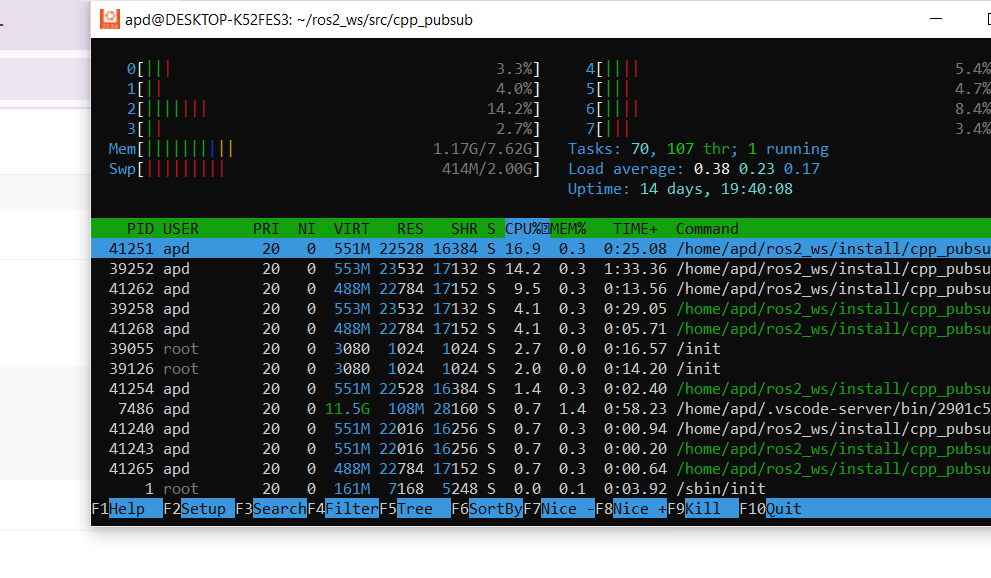

# cpp_pubsub

A comprehensive ROS 2 example package demonstrating C++ publisher and subscriber nodes, including simulated sensor data publishers and sensor fusion capabilities.

## 🎯 Overview

This package provides practical examples of ROS 2 communication patterns using C++, featuring:

- **Basic Publisher/Subscriber**: Simple text message communication
- **Sensor Simulation**: Realistic GPS and IMU data publishers
- **Multi-Subscriber Pattern**: Single node subscribing to multiple topics
- **Sensor Fusion**: Combines GPS and IMU data with simple averaging logic
- **Clean Architecture**: Well-structured C++ code following ROS 2 best practices

## 📦 Package Contents

### Core Nodes

| Node | Type | Description |
|------|------|-------------|
| `talker` | Publisher | Publishes "Hello, world!" messages to `/topic` |
| `listener` | Subscriber | Receives and displays messages from `/topic` |
| `gps_publisher` | Publisher | Simulates GPS sensor data on `/gps_topic` |
| `imu_publisher` | Publisher | Simulates IMU sensor data on `/imu_topic` |
| `multi_subscriber` | Subscriber | Listens to both GPS and IMU topics simultaneously |
| `fusion_node` | Fusion | Combines GPS and IMU data with averaging logic |

### Topic Architecture

```
┌─────────────────┐    /topic    ┌─────────────────┐
│     talker      │──────────────▶│    listener     │
└─────────────────┘              └─────────────────┘

┌─────────────────┐  /gps_topic  ┌─────────────────┐
│  gps_publisher  │──────────────▶│ multi_subscriber│
└─────────────────┘              └─────────────────┘
                                                   
┌─────────────────┐  /imu_topic  ┌─────────────────┐
│  imu_publisher  │──────────────▶│   fusion_node   │
└─────────────────┘              └─────────────────┘
                                          ▲
┌─────────────────┐  /gps_topic           │
│  gps_publisher  │───────────────────────┘
└─────────────────┘
```

## 🚀 Quick Start

### Prerequisites

- ROS 2 Humble (or compatible distribution)
- C++14 compiler
- colcon build tool

### Installation

1. **Clone the package** into your ROS 2 workspace:
   ```bash
   cd ~/ros2_ws/src
   # git clone <your-repository-url>
   ```

2. **Build the package**:
   ```bash
   cd ~/ros2_ws
   colcon build --packages-select cpp_pubsub
   ```

3. **Source the workspace** (required for each new terminal):
   ```bash
   source install/local_setup.bash
   ```

## 💻 Usage Examples

### Phase 1: Basic Publisher/Subscriber Demo

**Terminal 1** - Run the publisher:
```bash
ros2 run cpp_pubsub talker
```

**Terminal 2** - Run the subscriber:
```bash
cd ~/ros2_ws
source install/local_setup.bash
ros2 run cpp_pubsub listener
```

### Phase 2: Sensor Simulation Demo

**Terminal 1** - GPS data publisher:
```bash
ros2 run cpp_pubsub gps_publisher
```

**Terminal 2** - IMU data publisher:
```bash
ros2 run cpp_pubsub imu_publisher
```

**Terminal 3** - Multi-subscriber (receives both GPS and IMU):
```bash
ros2 run cpp_pubsub multi_subscriber
```

### Phase 3: Sensor Fusion Demo

**Terminal 1** - GPS data publisher:
```bash
ros2 run cpp_pubsub gps_publisher
```

**Terminal 2** - IMU data publisher:
```bash
ros2 run cpp_pubsub imu_publisher
```

**Terminal 3** - Fusion node (combines GPS and IMU data):
```bash
ros2 run cpp_pubsub fusion_node
```

The fusion node subscribes to both `/gps_topic` and `/imu_topic`. When both data sources are available, it applies simple averaging logic to combine the position data and prints the fused result.

## 📊 Topic Details

| Topic | Message Type | Publisher | Subscriber(s) | Description |
|-------|-------------|-----------|---------------|-------------|
| `/topic` | `std_msgs::msg::String` | talker | listener | Basic text messages |
| `/gps_topic` | `sensor_msgs::msg::NavSatFix` | gps_publisher | multi_subscriber, fusion_node | Simulated GPS coordinates |
| `/imu_topic` | `sensor_msgs::msg::Imu` | imu_publisher | multi_subscriber, fusion_node | Simulated IMU data |

## 🔧 Development

### File Structure
```
cpp_pubsub/
├── CMakeLists.txt
├── package.xml
├── src/
│   ├── publisher_member_function.cpp    # talker node
│   ├── subscriber_member_function.cpp   # listener node
│   ├── gps_publisher.cpp               # GPS simulation
│   ├── imu_publisher.cpp               # IMU simulation
│   ├── multi_subscriber.cpp            # Multi-topic subscriber
│   └── fusion_node.cpp                 # Sensor fusion node
└── README.md
```

### Fusion Logic

The fusion node implements simple averaging logic:
- Waits for both GPS and IMU data to be available
- Averages position data when both sensors have fresh data
- Prints the combined/fused result
- Can be easily extended with more sophisticated fusion algorithms

### Customization

You can easily modify the nodes to:
- Change publication rates
- Simulate different sensor values
- Add new sensor types
- Implement advanced fusion algorithms (Kalman filters, etc.)
- Modify message formats

### Building Individual Nodes

To build only this package:
```bash
colcon build --packages-select cpp_pubsub
```

## 🐛 Troubleshooting

### Common Issues

**Node not found**: Make sure you've sourced the workspace in each terminal:
```bash
source install/local_setup.bash
```

**Build errors**: Ensure all dependencies are installed:
```bash
rosdep install --from-paths src --ignore-src -r -y
```

**No messages received**: Check if publisher and subscriber are running and topics match:
```bash
ros2 topic list
ros2 topic echo /gps_topic
```

**Fusion node not working**: Ensure both GPS and IMU publishers are running before starting the fusion node.

## 📝 Additional Commands

### Monitoring Topics
```bash
# List all active topics
ros2 topic list

# Monitor GPS data
ros2 topic echo /gps_topic

# Monitor IMU data
ros2 topic echo /imu_topic

# Check topic information
ros2 topic info /gps_topic
```

### Node Information
```bash
# List running nodes
ros2 node list

# Get node information
ros2 node info /fusion_node
```

### System Performance Monitoring
```bash
# Monitor CPU usage of ROS 2 nodes
htop

# Filter to see only ROS 2 processes
htop -p $(pgrep -d',' ros2)

# Monitor system resources while running nodes
top -p $(pgrep -d',' -f "ros2|cpp_pubsub")
```

**Performance Tips:**
- Use `htop` to monitor CPU usage when running multiple nodes
- Check memory consumption during sensor fusion operations
- Monitor system load when running all nodes simultaneously
- Consider node priority if system resources are limited

## 🎯 Development Phases

### ✅ Phase 1: Basic Communication
- Simple talker/listener pattern
- String message publishing/subscribing

### ✅ Phase 2: Sensor Simulation
- GPS publisher with NavSatFix messages
- IMU publisher with Imu messages
- Multi-subscriber for both topics

### ✅ Phase 3: Sensor Fusion
- Fusion node combining GPS and IMU data
- Simple averaging logic for position fusion
- Synchronized data processing
- CPU usage monitoring with htop

### 🔥 ✅ Phase 4: Profiling and Bottleneck Analysis
Goal: Learn to profile ROS 2 code for performance optimization
Setup & Installation
Install profiling tools:
bashsudo apt install linux-tools-common linux-tools-generic
Profiling Commands
bash# Profile a specific ROS 2 node
perf record -g ros2 run cpp_pubsub fusion_node

#### Generate flame graph
```bash
perf script | flamegraph.pl > fusion_profile.svg
```

#### Monitor real-time performance
```bash
perf top -p $(pgrep fusion_node)
```

#### CPU usage monitoring
Here's a sample htop screenshot showing CPU usage during Phase 4:



*Screenshot shows ROS 2 nodes running with their respective CPU usage percentages*

Deliverables
Performance baseline measurements
Flame graph visualization of fusion node
Identified bottlenecks and optimization opportunities
Performance comparison before/after optimizations

### Phase 5: Implement Kalman Filter
Goal: Apply advanced sensor fusion using Extended Kalman Filter (EKF) logic
Implementation Details
State Vector:
```cpp
// State: [x, y, vx, vy, ax, ay]
Eigen::VectorXd state(6);
```

EKF Node Structure:
```cpp
class EKFNode : public rclcpp::Node {
private:
    void predict();           // Time update
    void update_gps();        // GPS measurement update
    void update_imu();        // IMU measurement update
    
    Eigen::MatrixXd P;        // Covariance matrix
    Eigen::MatrixXd Q;        // Process noise
    Eigen::MatrixXd R_gps;    // GPS measurement noise
    Eigen::MatrixXd R_imu;    // IMU measurement noise
};
```

Usage Example
Terminal 1 - GPS publisher
```bash
ros2 run cpp_pubsub gps_publisher
```
Terminal 2 - IMU publisher 
```bash
ros2 run cpp_pubsub imu_publisher
```

Terminal 3 - EKF fusion node
```bash
ros2 run cpp_pubsub ekf_fusion_node
```

Deliverables
EKF fusion node implementation
Comparison with simple averaging fusion
State estimation accuracy metrics
Real-time filtered pose output on /filtered_pose topic

Performance Metrics
Position estimation accuracy (RMSE)
Velocity estimation stability
Filter convergence time
Computational efficiency vs. simple fusion


> **Note**: Remember to source your workspace (`source install/local_setup.bash`) in each new terminal before running ROS 2 commands.
